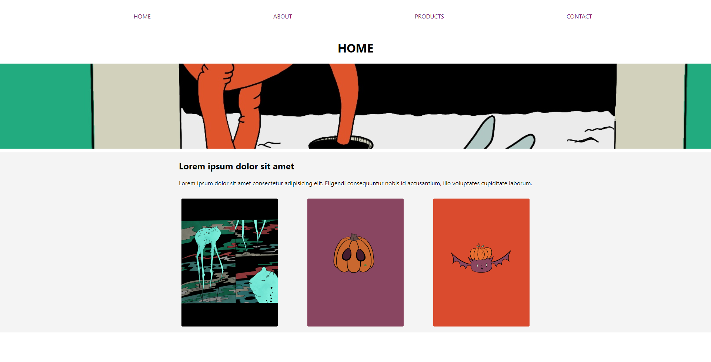
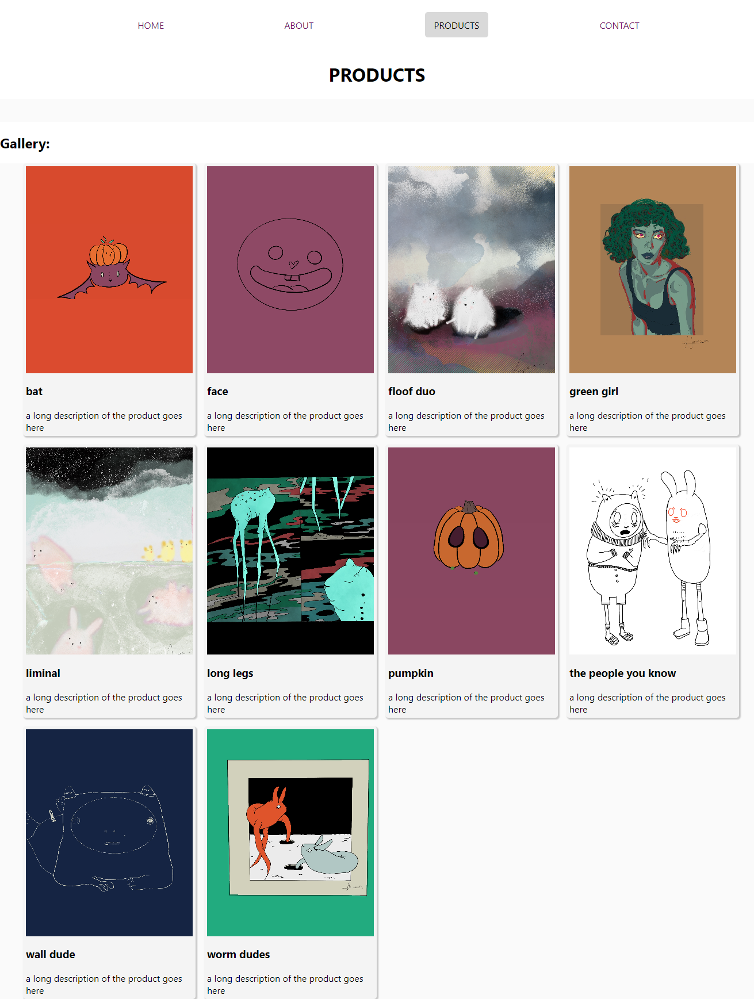

# simple-mvc-project [simple-mvc-project](https: //simple-mvc-project.netlify.app/)

## Description:

Simple responsive single-page application demonstrating use of MVC architectural pattern, jQuery, and hash changes to load content.

### Features/Tools:

- SCSS/SASS [sass-lang.com](https://sass-lang.com/)
- Compiled with Prepros [prepros.io](https://prepros.io/)
- Deployed to Netlify from GitHub [docs.netlify.com](https://docs.netlify.com/?_gl=1%2a1syaull%2a_gcl_aw%2aR0NMLjE2NjU1MDAyODAuQ2p3S0NBandxSlNhQmhCVUVpd0FnNVc5cDI1ZE9FeVo5V1dKNUJuZG5xYzR5ZDhpVHJ2cEJjdDZwMWY0SWZiVDktNmxvNDh2NVdVYTdCb0NpQ2tRQXZEX0J3RQ..&_ga=2.23610297.2048201622.1665500281-1565962330.1663592803&_gac=1.154945098.1665500281.CjwKCAjwqJSaBhBUEiwAg5W9p25dOEyZ9WWJ5Bndnqc4yd8iTrvpBct6p1f4IfbT9-6lo48v5WUa7BoCiCkQAvD_BwE)

View the project at [simple-mvc-project.netlify.app](https: //simple-mvc-project.netlify.app/)

#### Screenshots:

Screenshot of home page:

Screenshot of products page:

